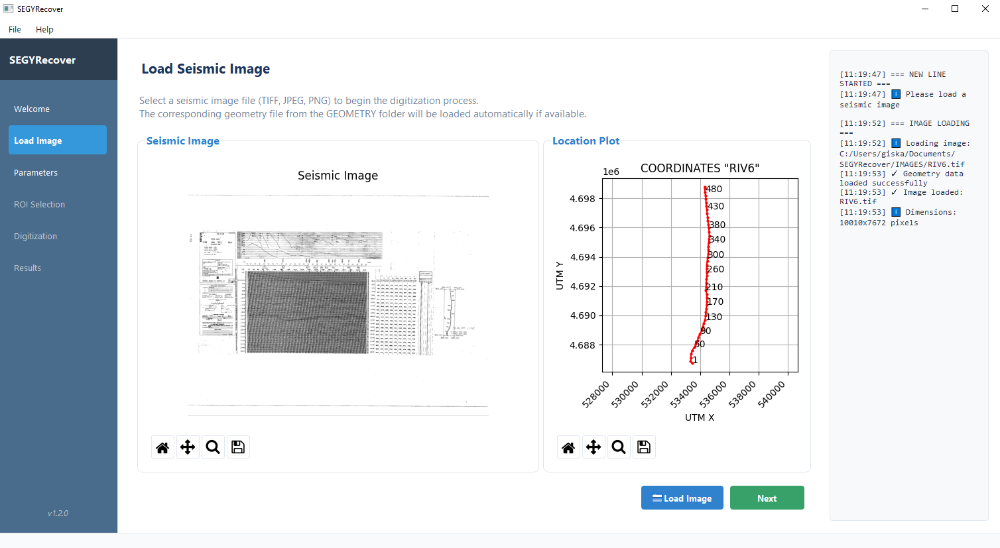
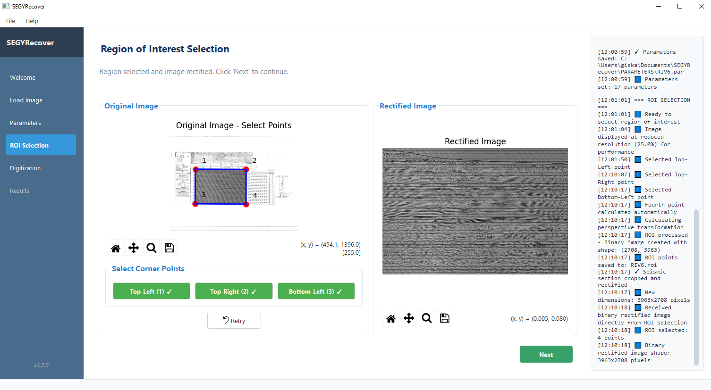
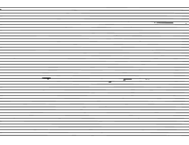
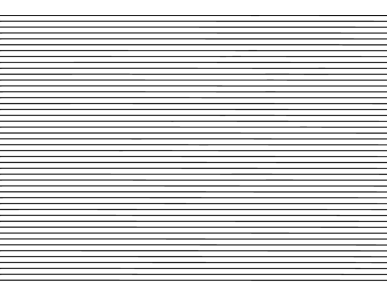
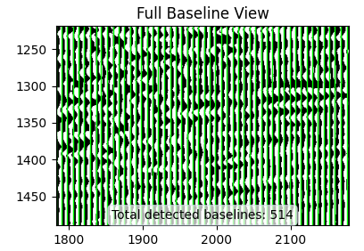
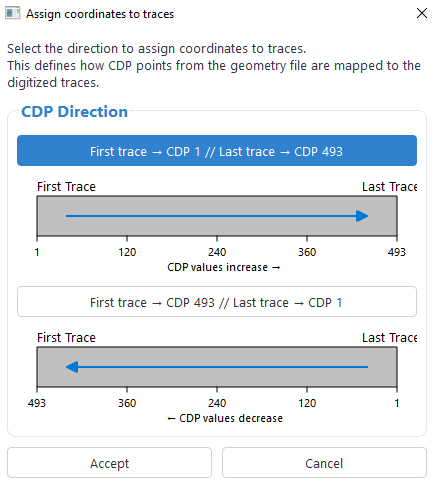
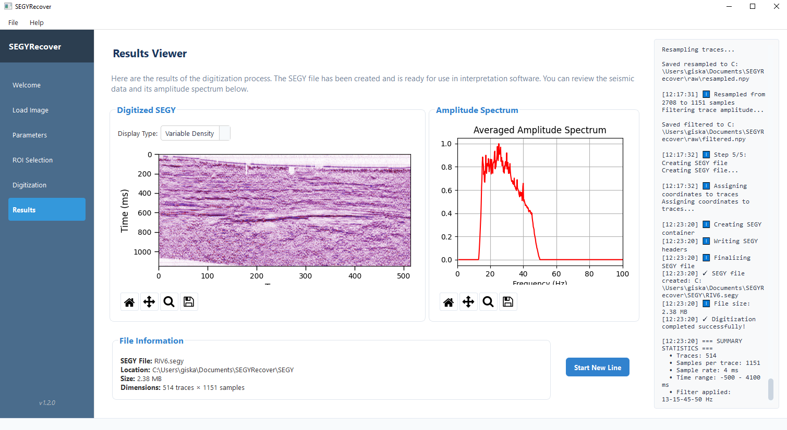

# SEGYRecover

[](https://doi.org/10.5281/zenodo.15053412)
[](https://pypi.org/project/segyrecover/)
[](https://github.com/a-pertuz/segyrecover/commits/main)
[](https://www.gnu.org/licenses/gpl-3.0.en.html)
[](https://www.python.org/downloads/)

A Python tool for digitizing scanned seismic reflection sections and converting them to standard SEG-Y format. SEGYRecover automatically removes timelines, detects trace baselines, extracts amplitude information for each trace, and produces usable SEG-Y files for modern interpretation software.

SEGYRecover is part of a collection of open source tools to digitize and enhance vintage seismic sections. See https://a-pertuz.github.io/REVSEIS/ for more information.

<details open>
<summary><h2>📖 Table of Contents</h2></summary>

- [Features](#features)
- [System Requirements](#system-requirements)
- [Installation](#installation)
- [Before You Begin](#before-you-begin)
- [Quick Start (5 Steps)](#quick-start-5-steps)
- [Complete Tutorial](#complete-tutorial)
- [Advanced Topics](#advanced-topics)
- [Citation](#citation)
- [References](#references)
- [License](#license)

</details>

<details open>
<summary><h2>✨ Features</h2></summary>

- **Digitization of seismic images** - Convert paper/raster seismic sections into SEGY files compatible with modern interpretation software
- **User-friendly GUI** - Simple interface for the entire digitization workflow
- **Perspective correction** - Handles skewed or distorted scanned images
- **Automatic trace line detection** - Identifies and digitized individual traces, preserving the original number of traces
- **Timeline detection and removal** - Detects and removes horizontal timelines
- **Amplitude extraction** - Converts pixel density to the right of each trace to seismic amplitude values for each trace
- **Frequency filtering** - Apply bandpass filters to clean up digitized data
- **Geospatial referencing** - Associates traces with real-world coordinates

</details>

<details>
<summary><h2>💻 System Requirements</h2></summary>

- **Operating System**: Windows 10/11
- **Memory**: At least 8GB RAM
- **Python**: 3.12+ (automatically handled if installing via pip)
- **Disk Space**: Sufficient space for images and output files
- **Image Requirements**: 
  - Binary images (black and white pixels only)
  - Supported formats: TIF, JPG, PNG
  - Variable area/wiggle display with positive amplitude filled in black

</details>

<details>
<summary><h2>⚙️ Installation</h2></summary>

### Windows Installation

1. **Install Python** (if not already installed):
   - Download Python from [python.org](https://www.python.org/downloads/windows/)
   - During installation, make sure to check **"Add Python to PATH"**
   - Click "Install Now" and wait for installation to complete

2. **Install SEGYRecover**:
   - Open Command Prompt (search for "cmd" in Windows search)
   - Type the following command and press Enter:

   ```bash
   pip install segyrecover
   ```

   Alternatively, install the latest development version directly from GitHub:
   ```bash
   python -m pip install git+https://github.com/a-pertuz/segyrecover.git
   ```

3. **Launch the program**:
   After installation, simply type:
   ```bash
   segyrecover
   ```

### First Run Setup

When you run SEGYRecover for the first time:


- You'll be prompted to choose a data storage location
- Choose a location with plenty of disk space
- Example files will be copied to your selected location
- The application will create the necessary folder structure

### Creating a Desktop Shortcut

1. Right-click on your desktop
2. Select "New" → "Shortcut"
3. Type `segyrecover` (if installed via pip)
4. Click "Next" and give the shortcut a name (e.g., "SEGYRecover")
5. Click "Finish"

</details>

<details>
<summary><h2>📁 Before You Begin</h2></summary>

### File Organization

SEGYRecover uses the following folder structure:

```
segyrecover/
├── IMAGES/               # Store input seismic images
├── GEOMETRY/             # Store .geometry files with trace coordinates
├── LOG/                  # Store log files 
├── ROI/                  # Store region of interest points
├── PARAMETERS/           # Store processing parameters
└── SEGY/                 # Store output SEGY files
```

### Prepare Your Data

1. **Place seismic images** in the `IMAGES` folder
2. **Create geometry files** (optional) in the `GEOMETRY` folder with format:
   ```
   CDP_NUMBER X_COORDINATE Y_COORDINATE
   100 500000.0 4500000.0
   101 500025.0 4500020.0
   ```
   - Files should have `.geometry` extension
   - Same base name as corresponding image files
   - Only first and last CDP points needed (software interpolates)

3. **Verify image quality**:
   - Higher resolution images yield better results
   - Minimal annotations overlapping seismic data
   - Clear trace lines and timelines

</details>

<details open>
<summary><h2>🚀 Quick Start (5 Steps)</h2></summary>

1. **Launch** → Run `segyrecover` and click "Start New Line"
2. **Load** → Select your seismic image file
3. **Configure** → Set parameters (trace coordinates, sample rate, frequency band)
4. **Select** → Mark three corners of your seismic section (ROI)
5. **Process** → Click "Start Digitization" and wait for completion

Your SEG-Y file will be saved in the `SEGY` folder and can be loaded into interpretation software.

</details>

<details open>
<summary><h2>📚 Complete Tutorial</h2></summary>

### Step 1: Loading an Image



1. From the Welcome screen, click **"Start New Line"**
2. Click **"Load Image"** to select your seismic section file
3. Navigate to your image and click "Open"
4. The image displays in the preview area with coordinate file info
5. Click "Next" to proceed to Parameters

> **Note**: The console panel shows image details including dimensions and file path.

### Step 2: Setting Parameters


Configure how the software interprets your seismic image:

1. After loading, you're taken to the Parameters tab
2. Previously saved parameters load automatically if available
3. Fill in the parameter sections below
4. Click **"Save Parameters"** to store settings
5. Click **"Next"** to proceed to ROI Selection

#### Region of Interest Corner Points
Map image pixels to seismic coordinates:

- **P1 (Top Left)**: Trace number and TWT (Two-Way Time) value
- **P2 (Top Right)**: Trace number and TWT value  
- **P3 (Bottom Left)**: Trace number and TWT value

**Example**: 
- P1: Trace 100 at 0 ms (top left)
- P2: Trace 500 at 0 ms (top right)  
- P3: Trace 100 at 3000 ms (bottom left)

> **Note**: Use negative time values for data above datum (e.g., -200 ms)

#### Acquisition Parameters
- **Sample Rate (ms)**: Time between data points (common: 2 or 4 ms)
- **Frequency Band (Hz)**: Four-value bandpass filter:
  - F1: Start cutting below this frequency
  - F2: Keep everything above this frequency
  - F3: Keep everything below this frequency  
  - F4: Start cutting above this frequency

**Common Values**:
- Vintage data: F1=8, F2=12, F3=60, F4=80
- Modern data: F1=3, F2=5, F3=80, F4=100

#### Detection Parameters
- **TLT (Traceline Thickness)**: Vertical trace width in pixels (usually 1)
- **HLT (Timeline Thickness)**: Horizontal timeline height in pixels (4-8)

#### Advanced Parameters
*Default values work for most images*

- **HE (Horizontal Erode)**: Timeline removal aggressiveness (100+ px)
- **BDB/BDE**: Trace detection start/end rows from top
- **BFT**: Duplicate trace filtering strictness (0-100%, default 80%)

### Step 3: Selecting Region of Interest



Mark three corners to define the digitization area:

1. You're automatically taken to ROI Selection after parameters
2. Image displays with corner point selection prompt
3. Use **magnifier** 🔍 to zoom to **top-left** corner
4. Click **"Top-left (1)"** button, then click desired point


5. Use **Home** 🏠 to return to full view
6. Zoom to **top-right** corner, select **(2)** and click point
7. Repeat for **bottom-left** corner
8. Fourth corner calculates automatically
9. Verify result and click "Accept"
10. Click "Next" for Digitization

> **Note**: ROI points save automatically for future reuse

### Step 4: Processing

Automatic processing workflow:

1. Click **"Start Digitization"** to begin
2. Monitor console for step-by-step progress
3. Select CDP direction when prompted
4. Review processing in visualization window

#### Processing Steps

**1. Timeline Detection and Removal**
- Isolates horizontal timeline marks
- Removes timelines from original image

| Timeline Detection Failure | Timeline Detection Success |
|:--------------------------:|:---------------------------:|
|  |  |
| HE parameter too low (200) | Correct isolation (HE=600) |

**2. Baseline Detection**
- Identifies vertical trace lines
- Shows verification with green baseline overlay



**3. Amplitude Extraction**  
- Counts black pixels per row between baselines
- Applies zero-value correction and smoothing
- Uses Akima interpolation for clipped values


**4. Data Processing**
- Resamples to specified sample rate
- Applies bandpass filtering

**5. SEG-Y Creation**
- Prompts for CDP direction (increasing/decreasing)
- Interpolates coordinates for all traces
- Creates standard SEG-Y with complete headers



### Step 5: Results



View and analyze your digitized data:

1. Digitized SEG-Y section displays in main view
2. Amplitude spectrum shows frequency content
3. Console provides digitization summary
4. Click "Start New Line" for next image

#### Accessing SEG-Y Files
- **File → Open Data Directory** → navigate to SEGY folder
- File location shown in console panel
- Compatible with OpendTect, Petrel, Leapfrog, Kingdom

</details>

<details>
<summary><h2>🔧 Advanced Topics</h2></summary>

### Menu Options

#### File Menu
- **Set Data Directory**: Change storage location
- **Open Data Directory**: Open data folder in Explorer

#### Help Menu  
- **HOW TO**: Step-by-step help dialog
- **About**: Software version and developer info

### Troubleshooting

#### Poor Timeline Detection
- Increase HE (Horizontal Erode) parameter
- Ensure ROI aligns timelines horizontally

#### Missing/Extra Baselines
- Adjust TLT to match trace width
- Modify BDB/BDE for cleaner detection areas
- Increase BFT to filter false detections

#### Noisy/Spiky Data
- Adjust frequency filter parameters (F1-F4)
- Use narrower frequency band
- Check ROI excludes non-seismic elements

#### Coordinate Issues
- Verify geometry file format (CDP, X, Y)
- Match CDP numbers between geometry and parameters
- Use consistent coordinate system (UTM recommended)

#### Log Files
Check `LOG` folder for detailed process logs and error messages.

### Frequently Asked Questions

**How can I improve quality?**
- Use highest resolution scans possible
- Experiment with frequency filter settings  
- Ensure proper timeline detection/removal
- Make precise ROI selections

**Batch processing available?**
Currently processes one image at a time. Use "Start New Line" sequentially and save parameters for similar images.

**No geometry data?**
Still digitizable but SEG-Y lacks real-world coordinates. Create placeholder file with first/last CDP numbers and arbitrary coordinates.

**Color images supported?**
Works best with black/white images. Convert color seismic to grayscale/binary before processing.

### Common Issues
- **Program not found**: Ensure Python added to PATH
- **Missing dependencies**: Run `pip install <package_name>`

</details>

<details>
<summary><h2>📄 Citation</h2></summary>

If you use this software in your research, please cite it as:

```
Pertuz, A., Benito, M. I., Llanes, P., Suárez-González, P., & García-Martín, M. (2025a). SEGYRecover: A Python GUI-based tool for digitizing vintage seismic reflection sections into SEG-Y files. Zenodo. https://doi.org/10.5281/zenodo.15053412
```

Find this software in the Zenodo Archive: [https://doi.org/10.5281/zenodo.15053412](https://doi.org/10.5281/zenodo.15053412)

</details>

<details>
<summary><h2>📖 References</h2></summary>

SEGYRecover uses several image processing and signal processing techniques. Some of them are covered by previous digitalization programs:

[1] Miles, P. R., Schaming, M., & Lovera, R. (2007). Resurrecting vintage paper seismic records. _Marine Geophysical Researches_, 28, 319-329.

[2] Farran, M. L. (2008). IMAGE2SEGY: Una aplicación informática para la conversión de imágenes de perfiles sísmicos a ficheros en formato SEGY. _Geo-Temas_, 10, 1215-1218. 

[3] Sopher, D. (2018). Converting scanned images of seismic reflection data into SEG-Y format. _Earth Science Informatics_, 11(2), 241-255.

</details>

<details>
<summary><h2>⚖️ License</h2></summary>

This software is licensed under the GNU General Public License v3.0 (GPL-3.0).

You may copy, distribute and modify the software as long as you track changes/dates in source files. 
Any modifications to or software including (via compiler) GPL-licensed code must also be made available 
under the GPL along with build & installation instructions.

For the full license text, see [LICENSE](LICENSE) or visit https://www.gnu.org/licenses/gpl-3.0.en.html

</details>

---

*For questions, support, or feature requests, please contact Alejandro Pertuz at apertuz@ucm.es*
